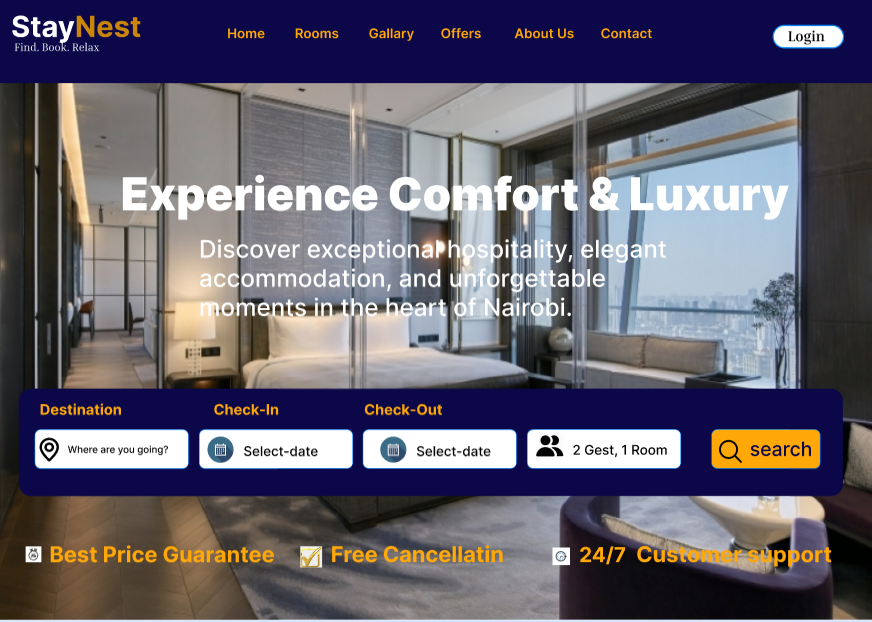
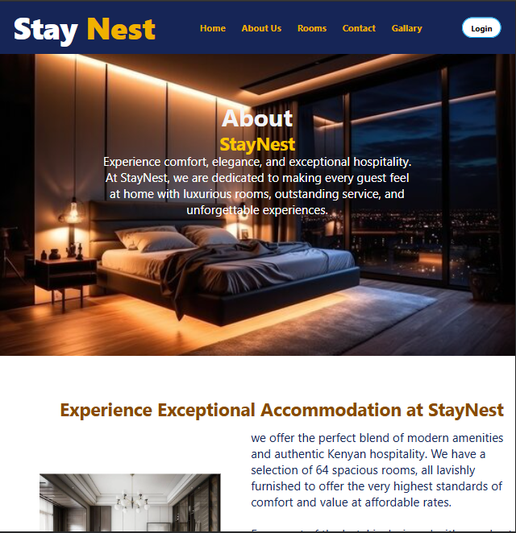

# StayNest 🏡

StayNest is a modern accommodation booking platform that helps users discover, explore, and reserve places to stay. It provides an intuitive interface for browsing listings, viewing property details, and managing bookings, with a responsive design that works across desktop and mobile devices.

## ✨ Features

- User-friendly and responsive interface
- Browse available accommodations
- View detailed property information
- Search and filter listings
- Secure user authentication
- Booking management
- Mobile-friendly design

## 🛠️ Technologies Used

Depending on the project implementation, this application may use:

- HTML5
- CSS3
- Cloudflare Pages (Deployment)

##  Home page

## About page

 ## Contact

 ## Gallary

## 👤 Author

**Nimo Ali**

https://www.figma.com/design/hUwxskh14fbrk4MVPJ97CY/Untitled?node-id=9-2&t=w4OatxF8LG6b6Btn-1

---

⭐ If you found this project useful, consider giving it a star on GitHub!
